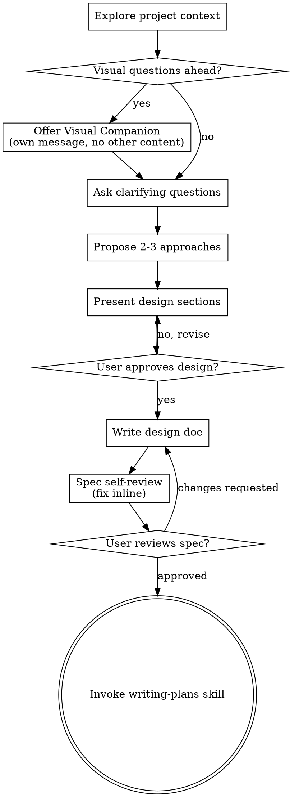

# アイデアを設計へとブレインストーミングする

自然で協調的な対話を通じて、アイデアを十分に練られた設計や仕様へと育てるのを支援する。

まず現在のプロジェクト文脈を把握し、その後、アイデアを磨くために一度に一つずつ質問する。何を作るのか理解できたら、設計を提示し、ユーザーの承認を得る。

<HARD-GATE>
設計を提示してユーザーが承認するまでは、いかなる implementation skill も呼び出してはならず、コードを書いたり、プロジェクトを scaffold したり、その他の実装アクションを取ってはならない。これは、どれほど単純に見えるプロジェクトでも必ず適用される。
</HARD-GATE>

## アンチパターン: 「これは単純すぎて設計はいらない」

あらゆるプロジェクトはこのプロセスを通る。todo リスト、単一関数のユーティリティ、設定変更――どれも例外ではない。「単純」なプロジェクトほど、検証されていない思い込みが無駄な作業を最も生みやすい。設計自体は短くてもよい（本当に単純なプロジェクトなら数文でもよい）が、必ず提示し、承認を得なければならない。

## チェックリスト

以下の各項目について必ずタスクを作成し、順番どおりに完了すること:

1. **プロジェクト文脈を調査する** — ファイル、ドキュメント、最近のコミットを確認する
2. **Visual Companion を提案する**（話題に視覚的な問いが含まれそうな場合）— これは単独のメッセージで行い、確認質問と組み合わせない。下の Visual Companion セクションを参照。
3. **確認質問をする** — 一度に一つずつ、目的・制約・成功条件を理解する
4. **2〜3 個のアプローチを提案する** — トレードオフと推奨案付きで示す
5. **設計を提示する** — 複雑さに応じた節に分け、各節ごとにユーザー承認を得る
6. **設計ドキュメントを書く** — `docs/superpowers/specs/YYYY-MM-DD-<topic>-design.md` に保存してコミットする
7. **仕様のセルフレビュー** — プレースホルダー、矛盾、曖昧さ、スコープをその場で素早く確認する（下記参照）
8. **ユーザーが書かれた仕様をレビューする** — 先に進む前に spec ファイルをレビューしてもらう
9. **実装へ移行する** — writing-plans skill を呼び出して実装計画を作成する

## プロセスフロー

**終端状態は writing-plans の呼び出しである。** frontend-design、mcp-builder、その他の implementation skill は呼び出してはならない。ブレインストーミングの次に呼び出す skill は writing-plans のみである。

## プロセス

**アイデアを理解する:**

- まず現在のプロジェクト状態（ファイル、ドキュメント、最近のコミット）を確認する
- 詳細な質問をする前にスコープを見極める: 要求が複数の独立したサブシステム（例: 「チャット、ファイル保存、請求、分析を備えたプラットフォームを作る」）を含む場合は、すぐにそれを指摘する。まず分解が必要なプロジェクトの詳細を、質問で詰め続けてはならない。
- ひとつの spec には大きすぎるプロジェクトなら、サブプロジェクトに分解できるよう支援する: 独立した要素は何か、それらはどう関係するか、どの順番で作るべきか。そのうえで、最初のサブプロジェクトについて通常の設計フローでブレインストーミングする。各サブプロジェクトはそれぞれ独自の spec → plan → implementation サイクルを持つ。
- 適切なスコープのプロジェクトなら、アイデアを磨くために一度に一つずつ質問する
- 可能なら多肢選択式の質問を優先するが、自由回答でもよい
- 1 メッセージにつき質問は 1 つだけ。さらに掘る必要があるなら複数メッセージに分ける
- 理解の焦点は、目的・制約・成功条件に置く

**アプローチを検討する:**

- トレードオフ付きで 2〜3 の異なるアプローチを提案する
- 推奨案とその理由を含めて、会話調で選択肢を提示する
- まず推奨案を先に示し、なぜそれを勧めるのか説明する

**設計を提示する:**

- 何を作るのか理解できたと思えたら、設計を提示する
- 各節の長さは複雑さに合わせる: 単純なら数文、ニュアンスが多いなら 200〜300 語程度まで
- 各節のあとで、ここまで正しいかを確認する
- 扱う内容: アーキテクチャ、コンポーネント、データフロー、エラーハンドリング、テスト
- 何か筋が通らなければ、戻って明確化できるようにしておく

**分離と明快さのために設計する:**

- システムを、目的が一つに明確化された小さな単位へ分割し、明確に定義されたインターフェースで通信させ、独立して理解・テストできるようにする
- 各単位について、何をするのか、どう使うのか、何に依存するのか、に答えられるようにする
- 内部実装を読まなくても、その単位が何をするのか理解できるか。内部を変えても利用側を壊さずに済むか。そうでなければ境界を見直す必要がある。
- 小さく境界が明確な単位のほうが、あなた自身も扱いやすい。ひとまとまりで文脈に保持できるコードほど推論しやすく、焦点の合ったファイルほど編集の信頼性も高い。ファイルが大きくなりすぎたら、それは多くを抱え込みすぎている兆候であることが多い。

**既存コードベースで作業する:**

- 変更案を出す前に、現在の構造を調査する。既存パターンに従う。
- 現在の作業に影響する問題が既存コードにある場合（例: 肥大化したファイル、不明瞭な境界、絡み合った責務）は、優れた開発者が作業対象のコードを改善するのと同じように、設計の一部として狙いを絞った改善を含める。
- 関係のないリファクタリングは提案しない。今の目標に資するものに集中する。

## 設計の後

**ドキュメント作成:**

- 検証済みの設計（spec）を `docs/superpowers/specs/YYYY-MM-DD-<topic>-design.md` に書く
  - （spec の保存場所に関するユーザー設定がある場合は、その設定を優先する）
- 利用可能なら elements-of-style:writing-clearly-and-concisely skill を使う
- 設計ドキュメントを git にコミットする

**仕様のセルフレビュー:**
spec ドキュメントを書いたあと、新鮮な目で見直す:

1. **プレースホルダー確認:** 「TBD」「TODO」、未完成の節、曖昧な要件はないか。あれば修正する。
2. **内部整合性:** 節同士で矛盾していないか。アーキテクチャは機能説明と一致しているか。
3. **スコープ確認:** 単一の実装計画に十分収まっているか。それとも分解が必要か。
4. **曖昧さ確認:** 2 通りに解釈できる要件はないか。あれば一つに決めて明示する。

問題があればその場で修正する。再レビューは不要。修正して先へ進めばよい。

**ユーザーレビューのゲート:**
spec レビューループを通過したら、先へ進む前にユーザーへ書かれた spec のレビューを依頼する:

> "Spec を `<path>` に書いてコミットしました。実装計画を書き始める前に、変更したい点があればレビューして教えてください。"

ユーザーの応答を待つ。変更依頼があれば反映し、spec レビューループをやり直す。ユーザーが承認したときだけ先へ進む。

**実装:**

- writing-plans skill を呼び出して、詳細な実装計画を作成する
- 他の skill は呼び出してはならない。次のステップは writing-plans である。

## 主要原則

- **一度に一つの質問** - 複数の質問で圧倒しない
- **多肢選択を優先** - 可能なら自由回答より答えやすい
- **YAGNI を徹底** - すべての設計から不要な機能を削る
- **代替案を探る** - 決め打ちせず、常に 2〜3 のアプローチを提示する
- **段階的に検証する** - 設計を提示し、承認を得てから次へ進む
- **柔軟である** - 何かが筋違いなら戻って明確化する

## Visual Companion

ブレインストーミング中にモックアップ、図、視覚的な選択肢を見せるためのブラウザベース companion。これは mode ではなく tool として利用できる。companion を受け入れるとは、視覚的な説明が有効な質問で使えるという意味であり、すべての質問をブラウザ経由で行うという意味ではない。

**companion の提案:** これからの質問に視覚的な内容（モックアップ、レイアウト、図）が含まれそうだと見込まれる場合、一度だけ同意を取るために提案する:
> "いま進めている内容の一部は、Web ブラウザーで見せながら説明したほうが分かりやすいかもしれません。進行に合わせて、モックアップ、図、比較表示などのビジュアルを用意できます。この機能はまだ新しく、token を多く使う場合があります。試してみますか？（ローカル URL を開く必要があります）"

**この提案は必ず単独のメッセージにすること。** 確認質問、文脈の要約、その他いかなる内容とも組み合わせてはならない。メッセージには上の提案文だけを含め、それ以外は入れない。続ける前にユーザーの応答を待つ。断られたら、テキストのみのブレインストーミングを続ける。

**質問ごとの判断:** ユーザーが受け入れたあとでも、**各質問ごとに** ブラウザを使うか terminal を使うか判断する。判断基準は、**読むより見たほうがユーザーに伝わるか** である。

- **ブラウザを使う** のは、内容そのものが視覚的な場合 — モックアップ、ワイヤーフレーム、レイアウト比較、アーキテクチャ図、並列のビジュアルデザイン比較
- **terminal を使う** のは、内容がテキストの場合 — 要件の質問、概念上の選択、トレードオフの一覧、A/B/C/D のテキスト選択肢、スコープ判断

UI に関する話題だからといって、自動的に視覚的な質問になるわけではない。「この文脈で personality とは何を意味しますか？」は概念的な質問なので terminal を使う。「どの wizard レイアウトのほうが良いか？」は視覚的な質問なのでブラウザを使う。

companion に同意されたら、先に詳細ガイドを読む:
`skills/brainstorming/visual-companion.md`
