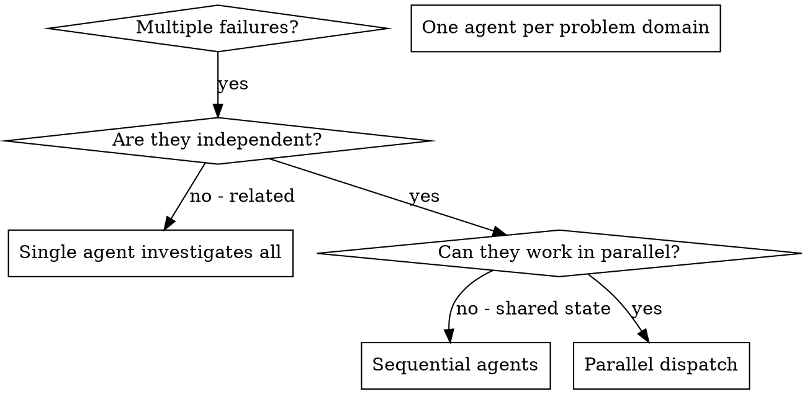

# Dispatching Parallel Agents

## 概要

分離されたコンテキストを持つ専用エージェントへタスクを委譲します。指示と文脈を正確に作ることで、各エージェントをそのタスクに集中させ、成功しやすくできます。エージェントにあなたのセッションの文脈や履歴を継承させてはいけません。必要なものはあなたが正確に構成します。これにより、調整作業のための自分のコンテキストも保てます。

無関係な失敗が複数ある場合（別々のテストファイル、別々のサブシステム、別々のバグなど）、それらを順番に調べるのは時間の無駄です。各調査は独立しており、並列に進められます。

**中核原則:** 独立した問題領域ごとに 1 エージェントを dispatch する。並行して作業させる。

## いつ使うか



**使う場面:**
- 異なる根本原因で 3 つ以上のテストファイルが失敗している
- 複数のサブシステムが独立して壊れている
- それぞれの問題を他の文脈なしで理解できる
- 調査間に共有状態がない

**使わない場面:**
- 失敗が関連している（1 つ直すと他も直るかもしれない）
- システム全体の状態を理解する必要がある
- エージェント同士が互いに干渉する

## パターン

### 1. 独立した領域を特定する

何が壊れているかで失敗をグループ化します:
- File A のテスト: Tool approval flow
- File B のテスト: Batch completion behavior
- File C のテスト: Abort functionality

各領域は独立しています。tool approval を直しても abort のテストには影響しません。

### 2. 集中したエージェントタスクを作る

各エージェントに渡すもの:
- **具体的なスコープ:** 1 つのテストファイルまたはサブシステム
- **明確な目標:** そのテストを通す
- **制約:** 他のコードは変更しない
- **期待する出力:** 見つけたことと直したことの要約

### 3. 並列で dispatch する

```typescript
// In Claude Code / AI environment
Task("Fix agent-tool-abort.test.ts failures")
Task("Fix batch-completion-behavior.test.ts failures")
Task("Fix tool-approval-race-conditions.test.ts failures")
// All three run concurrently
```

### 4. レビューして統合する

エージェントが戻ってきたら:
- 各要約を読む
- 修正同士が競合しないか確認する
- テストスイート全体を実行する
- すべての変更を統合する

## エージェントプロンプトの構造

良いエージェントプロンプトは次の条件を満たします:
1. **焦点が絞られている** - 明確な 1 つの問題領域
2. **自己完結している** - 問題理解に必要な文脈がすべてある
3. **出力が具体的** - エージェントに何を返してほしいかが明確

```markdown
Fix the 3 failing tests in src/agents/agent-tool-abort.test.ts:

1. "should abort tool with partial output capture" - expects 'interrupted at' in message
2. "should handle mixed completed and aborted tools" - fast tool aborted instead of completed
3. "should properly track pendingToolCount" - expects 3 results but gets 0

These are timing/race condition issues. Your task:

1. Read the test file and understand what each test verifies
2. Identify root cause - timing issues or actual bugs?
3. Fix by:
   - Replacing arbitrary timeouts with event-based waiting
   - Fixing bugs in abort implementation if found
   - Adjusting test expectations if testing changed behavior

Do NOT just increase timeouts - find the real issue.

Return: Summary of what you found and what you fixed.
```

## よくあるミス

**❌ 広すぎる:** "Fix all the tests" - エージェントが迷う  
**✅ 具体的:** "Fix agent-tool-abort.test.ts" - 焦点が絞られている

**❌ 文脈なし:** "Fix the race condition" - 場所が分からない  
**✅ 文脈あり:** エラーメッセージとテスト名を貼る

**❌ 制約なし:** 何でもリファクタしてしまうかもしれない  
**✅ 制約あり:** "Do NOT change production code" または "Fix tests only"

**❌ 出力が曖昧:** "Fix it" - 何が変わったか分からない  
**✅ 具体的:** "Return summary of root cause and changes"

## 使わないべき場面

**関連する失敗:** 1 つ直すと他も直るかもしれないので、まず一緒に調査する  
**全体文脈が必要:** 理解にシステム全体を見る必要がある  
**探索的デバッグ:** 何が壊れているかまだ分かっていない  
**共有状態がある:** エージェントが干渉する（同じファイル編集、同じリソース利用）

## セッションからの実例

**シナリオ:** 大きなリファクタリング後、3 ファイルにまたがって 6 件のテスト失敗

**失敗内容:**
- agent-tool-abort.test.ts: 3 failures（タイミング問題）
- batch-completion-behavior.test.ts: 2 failures（tool が実行されない）
- tool-approval-race-conditions.test.ts: 1 failure（execution count = 0）

**判断:** 独立した領域。abort ロジック、batch completion、race conditions はそれぞれ別。

**Dispatch:**
```
Agent 1 → Fix agent-tool-abort.test.ts
Agent 2 → Fix batch-completion-behavior.test.ts
Agent 3 → Fix tool-approval-race-conditions.test.ts
```

**結果:**
- Agent 1: timeouts を event-based waiting に置き換えた
- Agent 2: event structure のバグを修正（threadId が誤った場所にあった）
- Agent 3: 非同期 tool 実行完了を待つ処理を追加

**統合:** すべて独立した修正で競合なし、フルスイートもグリーン

**節約できた時間:** 3 問題を逐次ではなく並列で解決

## 主な利点

1. **並列化** - 複数の調査を同時に進められる
2. **集中** - 各エージェントのスコープが狭く、追う文脈が少ない
3. **独立性** - エージェント同士が干渉しない
4. **速度** - 1 件分の時間で 3 問題を解ける

## 検証

エージェントが返ってきた後:
1. **各要約をレビューする** - 何が変わったか理解する
2. **競合を確認する** - 同じコードを編集していないか？
3. **フルスイートを実行する** - すべての修正が一緒に動くことを確認する
4. **スポットチェックする** - エージェントは系統的なミスをすることがある

## 実運用での効果

デバッグセッション（2025-10-03）より:
- 3 ファイルで 6 件の失敗
- 3 エージェントを並列 dispatch
- すべての調査が同時に完了
- すべての修正を問題なく統合
- エージェント間の競合はゼロ

