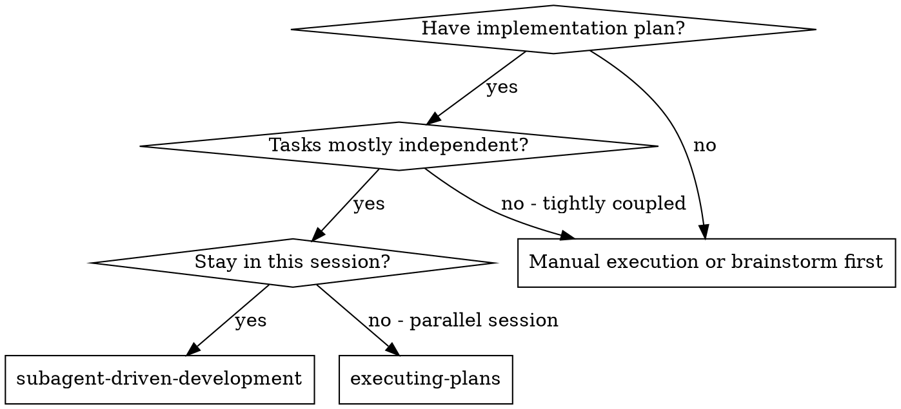
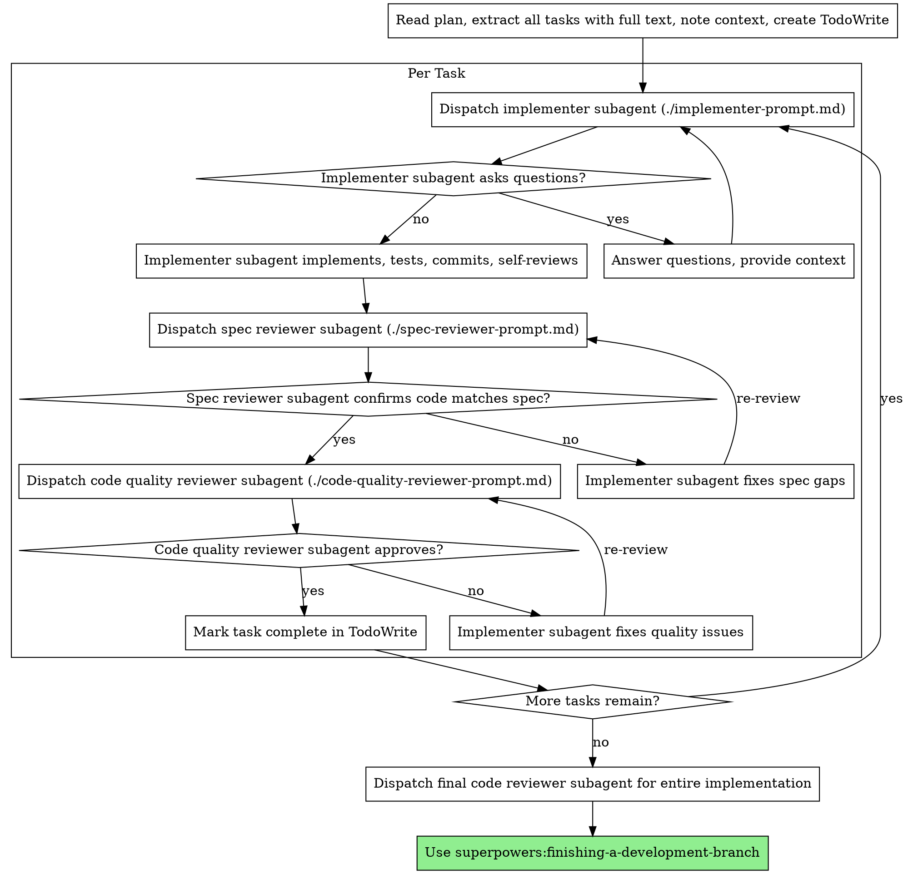

# Subagent-Driven Development

各タスクごとに新しいサブエージェントを起用して計画を実行し、各タスクの後に二段階レビューを行います。最初に仕様準拠レビュー、次にコード品質レビューです。

**サブエージェントを使う理由:** タスクごとに分離されたコンテキストを持つ専用エージェントへ委譲します。指示と文脈を正確に組み立てることで、エージェントをそのタスクに集中させ、成功しやすくできます。サブエージェントにあなたのセッションのコンテキストや履歴を継承させてはいけません。必要なものを正確にあなたが構成します。これにより、調整作業のための自分のコンテキストも保てます。

**中核原則:** タスクごとに新しいサブエージェント + 二段階レビュー（仕様 → 品質） = 高品質かつ高速な反復

**継続実行:** タスクの合間に人間のパートナーへ確認するために立ち止まってはいけません。計画内の全タスクを止まらずに実行してください。止まる理由は、解決できない BLOCKED 状態、本当に進行を妨げる曖昧さ、または全タスク完了だけです。「続けますか？」という確認や進捗要約は相手の時間を無駄にします。計画の実行を頼まれているのだから、実行してください。

## いつ使うか



**Executing Plans（並列セッション）との違い:**
- 同じセッションで進める（コンテキスト切り替えなし）
- タスクごとに新しいサブエージェントを使う（コンテキスト汚染なし）
- 各タスク後に二段階レビュー: 最初に仕様準拠、その後にコード品質
- より高速に反復できる（タスク間で人間を挟まない）

## プロセス



## モデル選択

コストを抑え速度を上げるため、各役割をこなせる範囲で最も非力なモデルを使ってください。

**機械的な実装タスク**（独立した関数、明確な仕様、1〜2ファイル）: 高速で安価なモデルを使います。計画が十分に具体的なら、多くの実装タスクは機械的です。

**統合や判断が必要なタスク**（複数ファイルの調整、パターン照合、デバッグ）: 標準モデルを使います。

**アーキテクチャ、設計、レビューのタスク**: 利用可能な中で最も高性能なモデルを使います。

**タスクの複雑さを示すシグナル:**
- 完全な仕様があり 1〜2 ファイルだけに触れる → 安価なモデル
- 統合上の懸念がある複数ファイルに触れる → 標準モデル
- 設計判断やコードベース全体への理解が必要 → 最も高性能なモデル

## Implementer ステータスの扱い

Implementer サブエージェントは 4 つのステータスのいずれかを報告します。それぞれに応じて適切に対応してください。

**DONE:** 仕様準拠レビューに進みます。

**DONE_WITH_CONCERNS:** 実装は完了したが、実装者が懸念を示しています。進む前にその懸念を読みます。正しさやスコープに関する懸念なら、レビュー前に対処してください。単なる所見（例: 「このファイルは大きくなってきている」）なら記録し、そのままレビューへ進みます。

**NEEDS_CONTEXT:** 提供されていない情報が必要です。足りない文脈を渡して再 dispatch します。

**BLOCKED:** そのタスクを完了できません。ブロッカーを評価します。
1. 文脈不足が原因なら、より多くの文脈を与えて同じモデルで再 dispatch する
2. より深い推論が必要なら、より高性能なモデルで再 dispatch する
3. タスクが大きすぎるなら、より小さな単位に分割する
4. 計画自体が誤っているなら、人間へエスカレーションする

Implementer のエスカレーションを**決して**無視してはいけません。また、何も変えずに同じモデルへ再試行を強いるのも禁止です。詰まっていると言ったなら、何かを変える必要があります。

## プロンプトテンプレート

- `./implementer-prompt.md` - implementer サブエージェントを dispatch する
- `./spec-reviewer-prompt.md` - 仕様準拠レビューアのサブエージェントを dispatch する
- `./code-quality-reviewer-prompt.md` - コード品質レビューアのサブエージェントを dispatch する

## ワークフロー例

```
You: I'm using Subagent-Driven Development to execute this plan.

[Read plan file once: docs/superpowers/plans/feature-plan.md]
[Extract all 5 tasks with full text and context]
[Create TodoWrite with all tasks]

Task 1: Hook installation script

[Get Task 1 text and context (already extracted)]
[Dispatch implementation subagent with full task text + context]

Implementer: "Before I begin - should the hook be installed at user or system level?"

You: "User level (~/.config/superpowers/hooks/)"

Implementer: "Got it. Implementing now..."
[Later] Implementer:
  - Implemented install-hook command
  - Added tests, 5/5 passing
  - Self-review: Found I missed --force flag, added it
  - Committed

[Dispatch spec compliance reviewer]
Spec reviewer: ✅ Spec compliant - all requirements met, nothing extra

[Get git SHAs, dispatch code quality reviewer]
Code reviewer: Strengths: Good test coverage, clean. Issues: None. Approved.

[Mark Task 1 complete]

Task 2: Recovery modes

[Get Task 2 text and context (already extracted)]
[Dispatch implementation subagent with full task text + context]

Implementer: [No questions, proceeds]
Implementer:
  - Added verify/repair modes
  - 8/8 tests passing
  - Self-review: All good
  - Committed

[Dispatch spec compliance reviewer]
Spec reviewer: ❌ Issues:
  - Missing: Progress reporting (spec says "report every 100 items")
  - Extra: Added --json flag (not requested)

[Implementer fixes issues]
Implementer: Removed --json flag, added progress reporting

[Spec reviewer reviews again]
Spec reviewer: ✅ Spec compliant now

[Dispatch code quality reviewer]
Code reviewer: Strengths: Solid. Issues (Important): Magic number (100)

[Implementer fixes]
Implementer: Extracted PROGRESS_INTERVAL constant

[Code reviewer reviews again]
Code reviewer: ✅ Approved

[Mark Task 2 complete]

...

[After all tasks]
[Dispatch final code-reviewer]
Final reviewer: All requirements met, ready to merge

Done!
```

## 利点

**手動実行との比較:**
- サブエージェントは自然に TDD に従う
- タスクごとに新しいコンテキスト（混乱しない）
- 並列安全（サブエージェント同士が干渉しない）
- サブエージェントは質問できる（作業前だけでなく作業中も）

**Executing Plans との比較:**
- 同じセッションで進められる（引き継ぎ不要）
- 継続的に進捗する（待ち時間がない）
- レビューチェックポイントが自動化される

**効率向上:**
- ファイル読解のオーバーヘッドがない（コントローラが全文を渡す）
- コントローラが必要な文脈だけを正確に絞り込む
- サブエージェントは最初から完全な情報を受け取る
- 質問が作業開始前に表面化する（後からではない）

**品質ゲート:**
- セルフレビューで handoff 前に問題を捕捉する
- 二段階レビュー: 仕様準拠、その後にコード品質
- レビューループによって修正が本当に機能することを確認できる
- 仕様準拠レビューで作り過ぎ・作り足りなさを防ぐ
- コード品質レビューで実装の作りを担保する

**コスト:**
- サブエージェント呼び出しが増える（implementer + 2 reviewer / task）
- コントローラの事前準備が増える（最初に全タスクを抽出する）
- レビューループで反復回数が増える
- ただし、問題を早期に捕捉できる（後でデバッグするより安い）

## レッドフラグ

**絶対にしないこと:**
- 明示的なユーザー同意なしに main/master ブランチで実装を始める
- レビューを省略する（仕様準拠またはコード品質のどちらかでも）
- 未解決の問題を残したまま進む
- 複数の実装サブエージェントを並列 dispatch する（競合する）
- サブエージェントに計画ファイルを読ませる（代わりに全文を渡す）
- シーン設定の文脈を省く（タスクがどこに位置づくか理解する必要がある）
- サブエージェントの質問を無視する（進めさせる前に答える）
- 仕様準拠で「だいたい合ってる」を許容する（spec reviewer が問題を見つけたら未完了）
- レビューループを省く（reviewer が問題発見 → implementer が修正 → 再レビューが必要）
- Implementer のセルフレビューで実レビューを置き換える（両方必要）
- **仕様準拠が ✅ になる前にコード品質レビューを始める**（順序が間違い）
- どちらかのレビューに未解決問題があるのに次のタスクへ進む

**サブエージェントが質問したら:**
- 明確かつ完全に答える
- 必要なら追加の文脈を渡す
- 実装を急がせない

**reviewer が問題を見つけたら:**
- Implementer（同じサブエージェント）が修正する
- Reviewer がもう一度レビューする
- 承認されるまで繰り返す
- 再レビューを飛ばさない

**サブエージェントがタスクに失敗したら:**
- 具体的な指示を添えて修正用サブエージェントを dispatch する
- 手動で直そうとしない（コンテキスト汚染）

## 統合

**必須のワークフロースキル:**
- **superpowers:using-git-worktrees** - 分離された workspace を確保する（新規作成または既存確認）
- **superpowers:writing-plans** - このスキルが実行する計画を作る
- **superpowers:requesting-code-review** - reviewer サブエージェント向けコードレビュー用テンプレート
- **superpowers:finishing-a-development-branch** - 全タスク完了後の開発作業を仕上げる

**サブエージェントが使うべきもの:**
- **superpowers:test-driven-development** - 各タスクでサブエージェントが TDD に従う

**代替ワークフロー:**
- **superpowers:executing-plans** - 同一セッション実行ではなく並列セッションで進める場合に使う

