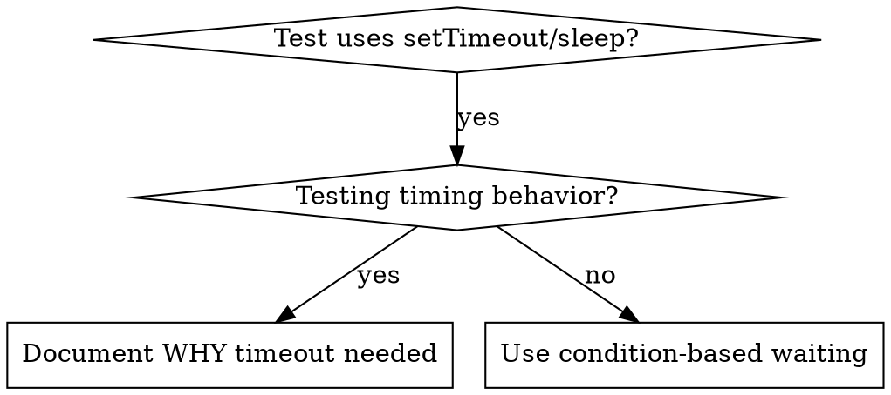

# Condition-Based Waiting

## 概要

Flaky な tests は、しばしば任意の遅延でタイミングを推測している。これにより、速いマシンでは通るが負荷時や CI では失敗する race conditions が生まれる。

**中核原則:** どれくらい時間がかかるかの推測ではなく、本当に待ちたい condition を待つこと。

## いつ使うか



**使う場面:**
- tests に任意の遅延がある（`setTimeout`、`sleep`、`time.sleep()`）
- tests が flaky である（通るときもあれば、負荷時に失敗する）
- 並列実行すると tests が timeout する
- async operation の完了待ちが必要

**使わない場面:**
- 実際の timing behavior（debounce、throttle intervals）をテストしているとき
- 任意の timeout を使うなら、必ず WHY を文書化すること

## 中核パターン

```typescript
// ❌ BEFORE: Guessing at timing
await new Promise(r => setTimeout(r, 50));
const result = getResult();
expect(result).toBeDefined();

// ✅ AFTER: Waiting for condition
await waitFor(() => getResult() !== undefined);
const result = getResult();
expect(result).toBeDefined();
```

## クイックパターン

| シナリオ | パターン |
|----------|---------|
| event を待つ | `waitFor(() => events.find(e => e.type === 'DONE'))` |
| state を待つ | `waitFor(() => machine.state === 'ready')` |
| count を待つ | `waitFor(() => items.length >= 5)` |
| file を待つ | `waitFor(() => fs.existsSync(path))` |
| 複雑な condition | `waitFor(() => obj.ready && obj.value > 10)` |

## 実装

汎用 polling 関数:
```typescript
async function waitFor<T>(
  condition: () => T | undefined | null | false,
  description: string,
  timeoutMs = 5000
): Promise<T> {
  const startTime = Date.now();

  while (true) {
    const result = condition();
    if (result) return result;

    if (Date.now() - startTime > timeoutMs) {
      throw new Error(`Timeout waiting for ${description} after ${timeoutMs}ms`);
    }

    await new Promise(r => setTimeout(r, 10)); // Poll every 10ms
  }
}
```

実際のデバッグセッションで使われた、ドメイン固有 helper（`waitForEvent`, `waitForEventCount`, `waitForEventMatch`）を含む完全実装は、このディレクトリの `condition-based-waiting-example.ts` を参照すること。

## よくあるミス

**❌ Polling が速すぎる:** `setTimeout(check, 1)` - CPU を無駄にする
**✅ 修正:** 10ms ごとに poll する

**❌ timeout がない:** condition が満たされないと永遠にループする
**✅ 修正:** 明確な error とともに必ず timeout を入れる

**❌ stale data:** ループ前に state を cache してしまう
**✅ 修正:** 新しいデータを得るために loop 内で getter を呼ぶ

## 任意の Timeout が正しい場合

```typescript
// Tool ticks every 100ms - need 2 ticks to verify partial output
await waitForEvent(manager, 'TOOL_STARTED'); // First: wait for condition
await new Promise(r => setTimeout(r, 200));   // Then: wait for timed behavior
// 200ms = 2 ticks at 100ms intervals - documented and justified
```

**要件:**
1. 最初にトリガーとなる condition を待つ
2. 既知のタイミングに基づいていること（推測ではない）
3. WHY を説明する comment を付ける

## 実務上の効果

デバッグセッション（2025-10-03）より:
- 3 ファイルにまたがる 15 個の flaky tests を修正
- 通過率: 60% → 100%
- 実行時間: 40% 高速化
- race conditions が解消
