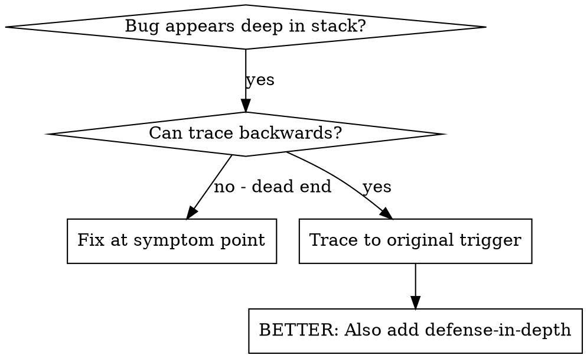
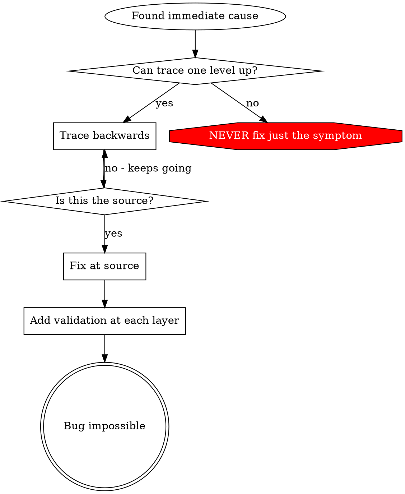

# Root Cause Tracing

## 概要

バグはしばしば call stack の深い場所に現れる（間違った directory での `git init`、誤った location に作られる file、誤った path で開かれる database）。本能的には error が出ている場所で直したくなるが、それは症状の対処にすぎない。

**中核原則:** 元のトリガーを見つけるまで call chain を逆向きに辿り、その source で修正する。

## いつ使うか



**使う場面:**
- error が実行の深い場所で起きている（entry point ではない）
- stack trace に長い call chain が見えている
- invalid data がどこで生まれたか不明
- どの test / code が問題を引き起こしているか特定したい

## Tracing のプロセス

### 1. 症状を観察する
```
Error: git init failed in ~/project/packages/core
```

### 2. 直接の原因を見つける
**何のコードがこれを直接引き起こしているか？**
```typescript
await execFileAsync('git', ['init'], { cwd: projectDir });
```

### 3. 問う: これを呼んだのは何か？
```typescript
WorktreeManager.createSessionWorktree(projectDir, sessionId)
  → called by Session.initializeWorkspace()
  → called by Session.create()
  → called by test at Project.create()
```

### 4. さらに上へ辿る
**どんな値が渡されたか？**
- `projectDir = ''`（空文字列！）
- `cwd` に空文字列を渡すと `process.cwd()` に解決される
- それが source code directory だ！

### 5. 元のトリガーを見つける
**空文字列はどこから来たか？**
```typescript
const context = setupCoreTest(); // Returns { tempDir: '' }
Project.create('name', context.tempDir); // Accessed before beforeEach!
```

## Stack Trace を追加する

手で辿れないときは instrumentation を追加する:

```typescript
// Before the problematic operation
async function gitInit(directory: string) {
  const stack = new Error().stack;
  console.error('DEBUG git init:', {
    directory,
    cwd: process.cwd(),
    nodeEnv: process.env.NODE_ENV,
    stack,
  });

  await execFileAsync('git', ['init'], { cwd: directory });
}
```

**重要:** tests では `console.error()` を使うこと（logger だと表示されないことがある）

**実行して取得する:**
```bash
npm test 2>&1 | grep 'DEBUG git init'
```

**stack traces を分析する:**
- test file 名を見る
- 呼び出しを引き起こしている行番号を見つける
- pattern を特定する（同じ test か？ 同じ parameter か？）

## どの test が pollution を起こすか見つける

tests 中に何かが起きているのに、どの test か分からない場合:

このディレクトリの二分探索スクリプト `find-polluter.sh` を使う:

```bash
./find-polluter.sh '.git' 'src/**/*.test.ts'
```

テストを 1 つずつ実行し、最初の polluter で止まる。使い方はスクリプトを参照すること。

## 実例: 空の projectDir

**症状:** `packages/core/`（source code）に `.git` が作られる

**追跡チェーン:**
1. `git init` が `process.cwd()` で走る ← `cwd` parameter が空
2. WorktreeManager が空の `projectDir` で呼ばれる
3. Session.create() が空文字列を渡した
4. test が `beforeEach` より前に `context.tempDir` にアクセスした
5. setupCoreTest() は初期状態で `{ tempDir: '' }` を返す

**root cause:** 空の値にアクセスする top-level variable initialization

**修正:** `beforeEach` より前にアクセスすると throw する getter に `tempDir` を変更した

**さらに defense-in-depth も追加した:**
- Layer 1: `Project.create()` が directory を検証
- Layer 2: `WorkspaceManager` が空でないことを検証
- Layer 3: `NODE_ENV` guard が tmpdir 外での `git init` を拒否
- Layer 4: `git init` 前の stack trace logging

## 重要原則



**error が出た場所だけを直してはならない。** 元のトリガーを見つけるために逆向きに辿ること。

## Stack Trace のコツ

**tests では:** `console.error()` を使い、logger は使わない - logger は抑制されることがある
**操作前に:** 危険な操作が失敗した後ではなく、前に log を出す
**文脈を含める:** Directory、cwd、environment variables、timestamps
**stack を取る:** `new Error().stack` で完全な call chain が見える

## 実務上の効果

デバッグセッション（2025-10-03）より:
- 5 段階の trace で root cause を発見
- source で修正（getter validation）
- 4 層の defense を追加
- 1847 件のテストが通過、pollution はゼロ
