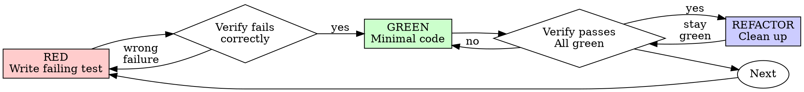

# テスト駆動開発（TDD）

## 概要

最初にテストを書く。失敗するのを確認する。通すための最小限のコードを書く。

**中核原則:** テストが失敗するのを見ていないなら、そのテストが正しいものを検証しているか分からない。

**ルールの文言に反することは、その精神に反することでもある。**

## いつ使うか

**常に:**
- 新機能
- バグ修正
- リファクタリング
- 振る舞いの変更

**例外（your human partner に確認すること）:**
- 使い捨てのプロトタイプ
- 生成コード
- 設定ファイル

「今回だけ TDD を飛ばそう」と考えている？ 立ち止まること。それは合理化だ。

## 鉄則

```
NO PRODUCTION CODE WITHOUT A FAILING TEST FIRST
```

テストより先にコードを書いた？ 削除して、最初からやり直すこと。

**例外なし:**
- 「参考」として残さない
- テストを書きながら「流用」しない
- 見返さない
- 削除とは本当に削除すること

テストから新しく実装する。以上。

## Red-Green-Refactor



### RED - 失敗するテストを書く

何が起きるべきかを示す最小のテストを 1 つ書く。

<Good>
```typescript
test('retries failed operations 3 times', async () => {
  let attempts = 0;
  const operation = () => {
    attempts++;
    if (attempts < 3) throw new Error('fail');
    return 'success';
  };

  const result = await retryOperation(operation);

  expect(result).toBe('success');
  expect(attempts).toBe(3);
});
```
名前が明確で、実際の振る舞いをテストしており、対象が 1 つに絞られている
</Good>

<Bad>
```typescript
test('retry works', async () => {
  const mock = jest.fn()
    .mockRejectedValueOnce(new Error())
    .mockRejectedValueOnce(new Error())
    .mockResolvedValueOnce('success');
  await retryOperation(mock);
  expect(mock).toHaveBeenCalledTimes(3);
});
```
名前が曖昧で、コードではなく mock をテストしている
</Bad>

**要件:**
- 1 つの振る舞い
- 明確な名前
- 実コード（避けられない場合を除き mocks は使わない）

### Verify RED - 失敗するのを確認する

**必須。絶対に飛ばさないこと。**

```bash
npm test path/to/test.test.ts
```

確認すること:
- テストが失敗していること（error ではない）
- 失敗メッセージが想定どおりであること
- 失敗理由が機能未実装であること（typo ではない）

**テストが通る？** 既存の振る舞いをテストしている。テストを修正すること。

**テストが error になる？** error を直し、正しく失敗するまで再実行すること。

### GREEN - 最小限のコード

テストを通すための最も単純なコードを書く。

<Good>
```typescript
async function retryOperation<T>(fn: () => Promise<T>): Promise<T> {
  for (let i = 0; i < 3; i++) {
    try {
      return await fn();
    } catch (e) {
      if (i === 2) throw e;
    }
  }
  throw new Error('unreachable');
}
```
通すのに必要な分だけ
</Good>

<Bad>
```typescript
async function retryOperation<T>(
  fn: () => Promise<T>,
  options?: {
    maxRetries?: number;
    backoff?: 'linear' | 'exponential';
    onRetry?: (attempt: number) => void;
  }
): Promise<T> {
  // YAGNI
}
```
過剰設計
</Bad>

機能を追加したり、他のコードをリファクタリングしたり、テストの範囲を超えて「改善」したりしてはならない。

### Verify GREEN - 通るのを確認する

**必須。**

```bash
npm test path/to/test.test.ts
```

確認すること:
- テストが通る
- 他のテストも引き続き通る
- 出力がクリーンである（errors, warnings なし）

**テストが失敗する？** テストではなくコードを直すこと。

**他のテストが失敗する？** 今すぐ直すこと。

### REFACTOR - 整える

green になってからだけ行う:
- 重複をなくす
- 名前を改善する
- ヘルパーを抽出する

テストは green のまま保つこと。振る舞いは追加しない。

### 繰り返す

次の機能に対する次の失敗テストを書く。

## 良いテスト

| 品質 | 良い | 悪い |
|---------|------|-----|
| **最小** | 1 つのことだけ。名前に "and" が入るなら分割する。 | `test('validates email and domain and whitespace')` |
| **明確** | 名前が振る舞いを説明している | `test('test1')` |
| **意図が伝わる** | 望ましい API を示している | コードが何をすべきかを見えにくくする |

## なぜ順序が重要なのか

**「動くことを確認するために、後からテストを書く」**

コードの後で書いたテストはすぐ通る。すぐ通ることは何の証明にもならない:
- 間違ったものをテストしているかもしれない
- 振る舞いではなく実装をテストしているかもしれない
- 忘れたエッジケースを見落としているかもしれない
- そのバグを実際に捕まえるのを見ていない

先にテストを書くことで、テストが実際に何かを検証していると証明できる失敗を確認せざるを得なくなる。

**「エッジケースはもう全部手で確認した」**

手動テストはアドホックだ。全部試したつもりでも:
- 何を試したか記録が残らない
- コードが変わったときに再実行できない
- プレッシャー下ではケースを忘れやすい
- 「試したら動いた」≠ 網羅的

自動テストは体系的だ。毎回同じ方法で実行される。

**「X 時間分の作業を削除するのは無駄だ」**

それは sunk cost fallacy だ。時間はすでに失われている。今の選択肢は:
- 削除して TDD で書き直す（さらに X 時間、高い確信）
- 残して後からテストを足す（30 分、低い確信、バグが入りがち）

本当の「無駄」は、信頼できないコードを残すことだ。まともなテストのない動くコードは技術的負債である。

**「TDD は教条的だ。実用的であるとは適応することだ」**

TDD こそ実用的だ:
- commit 前にバグを見つける（後からデバッグするより速い）
- リグレッションを防ぐ（壊れたら即座にテストが検出する）
- 振る舞いを文書化する（コードの使い方をテストが示す）
- リファクタリングを可能にする（自由に変更でき、壊れたらテストが教える）

「実用的」な近道 = 本番でデバッグ = より遅い。

**「後からテストしても同じ目的は達成できる。儀式ではなく精神の問題だ」**

違う。後からのテストが答えるのは「これは何をするか？」であり、先に書くテストが答えるのは「これは何をすべきか？」だ。

後からのテストは、あなたの実装に引きずられる。要求されたことではなく、自分が作ったものをテストする。発見されたエッジケースではなく、思い出せたエッジケースだけを確認する。

先に書くテストは、実装前にエッジケースを発見することを強制する。後からのテストは、自分が全部覚えていたかを確認するだけだ（覚えていない）。

後から 30 分で書いたテスト ≠ TDD。カバレッジは得られても、テストが機能している証明は失われる。

## よくある合理化

| 言い訳 | 現実 |
|--------|---------|
| "単純すぎてテスト不要" | 単純なコードも壊れる。テストは 30 秒で書ける。 |
| "後でテストする" | すぐ通るテストは何の証明にもならない。 |
| "後からでも同じ目的を達成できる" | 後からのテスト = 「これは何をするか？」 先のテスト = 「これは何をすべきか？」 |
| "もう手動でテストした" | アドホック ≠ 体系的。記録がなく、再実行できない。 |
| "X 時間削除するのは無駄" | sunk cost fallacy。未検証コードを残すのは技術的負債。 |
| "参考として残し、先にテストを書く" | どうせ流用する。それは後からのテストだ。削除とは削除。 |
| "まず探索が必要" | それでよい。ただし探索コードは捨て、TDD で始める。 |
| "テストしづらい = 設計がまだ曖昧" | テストの声を聞くこと。テストしづらいものは使いづらい。 |
| "TDD は遅くなる" | TDD はデバッグより速い。実用的とは test-first のこと。 |
| "手動テストの方が速い" | 手動ではエッジケースは証明できない。変更のたびに再テストすることになる。 |
| "既存コードにテストがない" | 今まさに改善しているのだから、既存コードにもテストを足す。 |

## 危険信号 - 止まってやり直す

- テストより先にコードを書く
- 実装後にテストを書く
- テストがすぐ通る
- なぜそのテストが失敗したか説明できない
- テストを「後で」追加する
- 「今回だけ」と合理化している
- 「もう手動でテストした」
- 「後からのテストでも同じ目的を達成できる」
- 「儀式ではなく精神の問題だ」
- 「参考として残す」または「既存コードを流用する」
- 「もう X 時間使ったから、削除するのは無駄だ」
- 「TDD は教条的だ、自分は実用的にやっている」
- 「これは違う。なぜなら...」

**これらはすべて意味することは同じ: コードを削除し、TDD でやり直すこと。**

## 例: バグ修正

**バグ:** 空の email が受け入れられてしまう

**RED**
```typescript
test('rejects empty email', async () => {
  const result = await submitForm({ email: '' });
  expect(result.error).toBe('Email required');
});
```

**Verify RED**
```bash
$ npm test
FAIL: expected 'Email required', got undefined
```

**GREEN**
```typescript
function submitForm(data: FormData) {
  if (!data.email?.trim()) {
    return { error: 'Email required' };
  }
  // ...
}
```

**Verify GREEN**
```bash
$ npm test
PASS
```

**REFACTOR**
必要なら複数フィールド向けに validation を抽出する。

## 検証チェックリスト

完了と見なす前に:

- [ ] 新しい関数/メソッドごとにテストがある
- [ ] 実装前に各テストが失敗するのを確認した
- [ ] 各テストが想定どおりの理由で失敗した（typo ではなく機能不足）
- [ ] 各テストを通すための最小限のコードを書いた
- [ ] すべてのテストが通る
- [ ] 出力がクリーンである（errors, warnings なし）
- [ ] テストは実コードを使っている（mocks は避けられない場合のみ）
- [ ] エッジケースと error ケースをカバーしている

すべてにチェックできない？ TDD を飛ばしたということだ。やり直すこと。

## 行き詰まったとき

| 問題 | 解決策 |
|---------|----------|
| どうテストすればよいか分からない | 望んでいる API を書く。最初に assertion を書く。your human partner に聞く。 |
| テストが複雑すぎる | 設計が複雑すぎる。インターフェースを単純化する。 |
| 何もかも mock しないといけない | コードの結合が強すぎる。dependency injection を使う。 |
| テスト準備が巨大 | ヘルパーを抽出する。それでも複雑？ 設計を単純化する。 |

## デバッグとの統合

バグを見つけた？ それを再現する失敗テストを書く。TDD サイクルに従うこと。テストは修正を証明し、リグレッションも防ぐ。

テストなしでバグを直してはならない。

## テストのアンチパターン

mocks やテストユーティリティを追加するときは、一般的な落とし穴を避けるために @testing-anti-patterns.md を読むこと:
- 実際の振る舞いではなく mock の振る舞いをテストする
- 本番クラスにテスト専用メソッドを追加する
- 依存関係を理解しないまま mock する

## 最後のルール

```
Production code → test exists and failed first
Otherwise → not TDD
```

your human partner の許可なしに例外はない。
