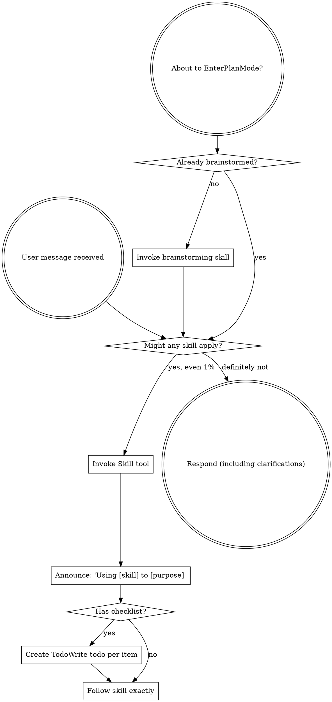

<SUBAGENT-STOP>
特定のタスクを実行する subagent として dispatch された場合は、この skill をスキップする。
</SUBAGENT-STOP>

<EXTREMELY-IMPORTANT>
今やっていることに skill が当てはまる可能性が 1% でもあると思うなら、その skill を必ず呼び出さなければならない。

あなたのタスクに skill が当てはまるなら、選択の余地はない。必ず使うこと。

これは交渉の余地がない。任意でもない。理屈をつけて回避してはならない。
</EXTREMELY-IMPORTANT>

## 命令の優先順位

Superpowers skills はデフォルトの system prompt の振る舞いを上書きするが、**ユーザーの指示が常に最優先** である:

1. **ユーザーの明示的な指示**（CLAUDE.md、GEMINI.md、AGENTS.md、直接の依頼）— 最優先
2. **Superpowers skills** — 衝突する場合はデフォルトの system prompt の振る舞いを上書きする
3. **デフォルトの system prompt** — 最下位

CLAUDE.md、GEMINI.md、または AGENTS.md に「TDD を使うな」とあり、skill に「常に TDD を使え」と書いてあれば、ユーザーの指示に従う。主導権はユーザーにある。

## Skills へのアクセス方法

**Claude Code では:** `Skill` tool を使う。skill を呼び出すと、その内容が読み込まれて提示されるので、その内容に直接従うこと。skill ファイルに `Read` tool を使ってはならない。

**Copilot CLI では:** `skill` tool を使う。skills はインストール済み plugin から自動検出される。`skill` tool は Claude Code の `Skill` tool と同じように機能する。

**Gemini CLI では:** skills は `activate_skill` tool で有効化する。Gemini はセッション開始時に skill metadata を読み込み、必要になったときに完全な内容を有効化する。

**その他の環境では:** skill の読み込み方法について、そのプラットフォームのドキュメントを確認する。

## プラットフォーム適応

skills は Claude Code の tool 名を使っている。CC 以外のプラットフォームでは、対応する tool 名として `references/copilot-tools.md`（Copilot CLI）および `references/codex-tools.md`（Codex）を参照すること。Gemini CLI の利用者には、GEMINI.md 経由で tool 対応表が自動的に読み込まれる。

# Skills の使い方

## ルール

**関連する skill または要求された skill は、いかなる応答やアクションよりも前に呼び出すこと。** skill が当てはまる可能性が 1% でもあるなら、確認のために呼び出すべきである。呼び出した skill が状況に合わないと分かった場合は、その skill を使い続ける必要はない。

## 危険信号

次のような考えが浮かんだら、立ち止まること。あなたは合理化しようとしている:

| Thought | Reality |
|---------|---------|
| "This is just a simple question" | Questions are tasks. Check for skills. |
| "I need more context first" | Skill check comes BEFORE clarifying questions. |
| "Let me explore the codebase first" | Skills tell you HOW to explore. Check first. |
| "I can check git/files quickly" | Files lack conversation context. Check for skills. |
| "Let me gather information first" | Skills tell you HOW to gather information. |
| "This doesn't need a formal skill" | If a skill exists, use it. |
| "I remember this skill" | Skills evolve. Read current version. |
| "This doesn't count as a task" | Action = task. Check for skills. |
| "The skill is overkill" | Simple things become complex. Use it. |
| "I'll just do this one thing first" | Check BEFORE doing anything. |
| "This feels productive" | Undisciplined action wastes time. Skills prevent this. |
| "I know what that means" | Knowing the concept ≠ using the skill. Invoke it. |

## Skill の優先順位

複数の skill が当てはまりうる場合は、この順序で使う:

1. **まずプロセス系 skills**（brainstorming、debugging）— タスクにどう取り組むかを決める
2. **次に実装系 skills**（frontend-design、mcp-builder）— 実行の指針を与える

「X を作ろう」→ まず brainstorming、その後に implementation skills。
「このバグを直して」→ まず debugging、その後にドメイン固有の skills。

## Skill の種類

**Rigid**（TDD、debugging）: 正確に従うこと。規律を勝手に緩めてはならない。

**Flexible**（patterns）: 原則を文脈に合わせて適用する。

どちらなのかは、その skill 自体が教えてくれる。

## ユーザー指示

指示が示すのは WHAT であって HOW ではない。「X を追加して」「Y を直して」は、ワークフローを省略してよい意味ではない。
