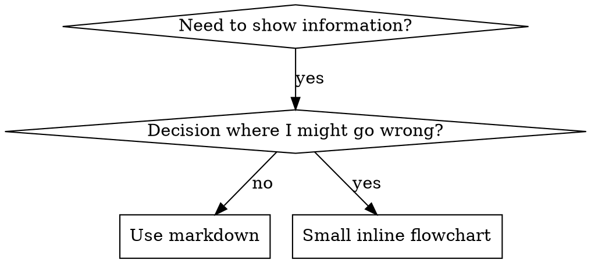

# Writing Skills

## 概要

**skill を書くことは、プロセス文書に適用した Test-Driven Development です。**

**個人用 skill は agent 固有ディレクトリに置きます（Claude Code なら `~/.claude/skills`、Codex なら `~/.agents/skills/`）**

テストケース（サブエージェントによる圧力シナリオ）を書き、それが失敗する様子（ベースライン挙動）を観察し、skill（文書）を書き、テストが通る様子（エージェントが従う）を見届け、最後にリファクタして抜け道を塞ぎます。

**中核原則:** skill なしの状態でエージェントが失敗するところを見ていないなら、その skill が正しいことを教えているか分かりません。

**必須の前提知識:** この skill を使う前に superpowers:test-driven-development を理解していなければなりません。あちらが基本の RED-GREEN-REFACTOR サイクルを定義します。この skill はそれを文書に適用します。

**公式ガイダンス:** Anthropic の公式な skill 作成ベストプラクティスは anthropic-best-practices.md を参照してください。この文書は、この skill の TDD 重視アプローチを補完する追加パターンとガイドラインを提供します。

## Skill とは何か？

**skill** とは、実証済みの技法、パターン、ツールのためのリファレンスガイドです。skill は将来の Claude インスタンスが有効なアプローチを見つけて適用するのを助けます。

**Skill は:** 再利用可能な技法、パターン、ツール、リファレンスガイド

**Skill ではないもの:** 一度だけどう解決したかを語るストーリー

## Skill における TDD 対応表

| TDD Concept | Skill Creation |
|-------------|----------------|
| **Test case** | サブエージェントによる圧力シナリオ |
| **Production code** | Skill 文書（SKILL.md） |
| **Test fails (RED)** | skill なしだとエージェントがルール違反する（ベースライン） |
| **Test passes (GREEN)** | skill があるとエージェントが従う |
| **Refactor** | 従わせたまま抜け道を塞ぐ |
| **Write test first** | skill を書く前にベースラインシナリオを実行する |
| **Watch it fail** | エージェントが使う合理化を正確に記録する |
| **Minimal code** | その違反に対処する最小限の skill を書く |
| **Watch it pass** | いまはエージェントが従うことを確認する |
| **Refactor cycle** | 新しい合理化を見つける → 塞ぐ → 再検証 |

skill 作成プロセス全体が RED-GREEN-REFACTOR に従います。

## Skill を作るタイミング

**作るべきとき:**
- その技法が自分にとって直感的に明らかではなかった
- 今後もプロジェクト横断で参照したくなる
- パターンが広く当てはまる（プロジェクト固有ではない）
- 他の人にも利益がある

**作らないべきもの:**
- 一回限りの解決策
- 他所で十分に文書化された標準的実践
- プロジェクト固有の規約（CLAUDE.md に書く）
- 機械的制約（regex/validation で強制できるなら自動化し、文書は判断が必要なものに残す）

## Skill の種類

### Technique

従うべき手順を持つ具体的な方法（condition-based-waiting、root-cause-tracing）

### Pattern

問題の捉え方（flatten-with-flags、test-invariants）

### Reference

API docs、構文ガイド、ツール文書（office docs）

## ディレクトリ構造

```
skills/
  skill-name/
    SKILL.md              # Main reference (required)
    supporting-file.*     # Only if needed
```

**フラットな namespace** - すべての skill が 1 つの検索可能な namespace に入る

**別ファイルに分けるのは:**
1. **重いリファレンス**（100 行超）- API docs、包括的な構文
2. **再利用可能なツール** - Script、utility、template

**インラインに保つもの:**
- 原則や概念
- コードパターン（50 行未満）
- その他すべて

## SKILL.md の構造

**フロントマター（YAML）:**
- 必須フィールドは `name` と `description` の 2 つ（対応する全フィールドは [agentskills.io/specification](https://agentskills.io/specification) を参照）
- 合計 1024 文字以内
- `name`: 文字、数字、ハイフンのみを使う（括弧や特殊文字なし）
- `description`: 三人称で、**使うべき状況だけ**を説明する（何をするかではない）
  - 発火条件に集中させるため "Use when..." で始める
  - 具体的な症状、状況、文脈を含める
  - **skill のプロセスやワークフローを絶対に要約しない**（理由は CSO セクション参照）
  - 可能なら 500 文字未満に保つ

```markdown
---
name: Skill-Name-With-Hyphens
description: Use when [specific triggering conditions and symptoms]
---

# Skill Name

## Overview
What is this? Core principle in 1-2 sentences.

## When to Use
[Small inline flowchart IF decision non-obvious]

Bullet list with SYMPTOMS and use cases
When NOT to use

## Core Pattern (for techniques/patterns)
Before/after code comparison

## Quick Reference
Table or bullets for scanning common operations

## Implementation
Inline code for simple patterns
Link to file for heavy reference or reusable tools

## Common Mistakes
What goes wrong + fixes

## Real-World Impact (optional)
Concrete results
```

## Claude Search Optimization (CSO)

**発見性にとって重要:** 将来の Claude はあなたの skill を見つけなければなりません

### 1. 豊かな Description フィールド

**目的:** Claude は与えられたタスクでどの skill を読むべきか判断するために description を読みます。description は「今この skill を読むべきか？」に答える必要があります。

**形式:** 発火条件に集中させるため "Use when..." で始める

**重要: Description = いつ使うか であり、Skill が何をするか ではない**

description には発火条件だけを書いてください。skill のプロセスやワークフローを description で要約してはいけません。

**これが重要な理由:** description が skill のワークフローを要約していると、Claude が skill 本文を読まず、その description に従ってしまうことがテストで分かりました。"code review between tasks" と書かれた description により、flowchart に二段階レビュー（spec compliance → code quality）が明示されていたにもかかわらず、Claude は 1 回しかレビューしませんでした。

description を単に "Use when executing implementation plans with independent tasks"（ワークフロー要約なし）に変更すると、Claude は flowchart を正しく読み、二段階レビュー手順に従いました。

**落とし穴:** ワークフロー要約型の description は、Claude が飛びつく近道を作ります。skill 本文が Claude に読み飛ばされる文書になってしまいます。

```yaml
# ❌ BAD: Summarizes workflow - Claude may follow this instead of reading skill
description: Use when executing plans - dispatches subagent per task with code review between tasks

# ❌ BAD: Too much process detail
description: Use for TDD - write test first, watch it fail, write minimal code, refactor

# ✅ GOOD: Just triggering conditions, no workflow summary
description: Use when executing implementation plans with independent tasks in the current session

# ✅ GOOD: Triggering conditions only
description: Use when implementing any feature or bugfix, before writing implementation code
```

**内容:**
- この skill が当てはまると示す具体的なトリガー、症状、状況を書く
- *言語特有の症状*（setTimeout、sleep）ではなく、*問題*（race conditions、一貫しない挙動）を書く
- skill 自体が技術固有でない限り、トリガーは技術非依存に保つ
- skill が技術固有なら、そのことをトリガーに明示する
- 三人称で書く（system prompt に注入されるため）
- **skill のプロセスやワークフローを絶対に要約しない**

```yaml
# ❌ BAD: Too abstract, vague, doesn't include when to use
description: For async testing

# ❌ BAD: First person
description: I can help you with async tests when they're flaky

# ❌ BAD: Mentions technology but skill isn't specific to it
description: Use when tests use setTimeout/sleep and are flaky

# ✅ GOOD: Starts with "Use when", describes problem, no workflow
description: Use when tests have race conditions, timing dependencies, or pass/fail inconsistently

# ✅ GOOD: Technology-specific skill with explicit trigger
description: Use when using React Router and handling authentication redirects
```

### 2. キーワード網羅

Claude が検索しそうな語を使います:
- エラーメッセージ: "Hook timed out", "ENOTEMPTY", "race condition"
- 症状: "flaky", "hanging", "zombie", "pollution"
- 同義語: "timeout/hang/freeze", "cleanup/teardown/afterEach"
- ツール: 実際のコマンド、ライブラリ名、ファイル種別

### 3. 説明的な命名

**能動態、動詞始まりを使う:**
- ✅ `creating-skills` であり `skill-creation` ではない
- ✅ `condition-based-waiting` であり `async-test-helpers` ではない

### 4. トークン効率（重要）

**問題:** getting-started と頻繁に参照される skill は **すべての会話** に読み込まれます。1 トークンごとに意味があります。

**目標語数:**
- getting-started workflows: 各 150 語未満
- 頻繁に読み込まれる skill: 合計 200 語未満
- その他の skill: 500 語未満（それでも簡潔に）

**テクニック:**

**詳細は tool help へ移す:**
```bash
# ❌ BAD: Document all flags in SKILL.md
search-conversations supports --text, --both, --after DATE, --before DATE, --limit N

# ✅ GOOD: Reference --help
search-conversations supports multiple modes and filters. Run --help for details.
```

**相互参照を使う:**
```markdown
# ❌ BAD: Repeat workflow details
When searching, dispatch subagent with template...
[20 lines of repeated instructions]

# ✅ GOOD: Reference other skill
Always use subagents (50-100x context savings). REQUIRED: Use [other-skill-name] for workflow.
```

**例を圧縮する:**
```markdown
# ❌ BAD: Verbose example (42 words)
your human partner: "How did we handle authentication errors in React Router before?"
You: I'll search past conversations for React Router authentication patterns.
[Dispatch subagent with search query: "React Router authentication error handling 401"]

# ✅ GOOD: Minimal example (20 words)
Partner: "How did we handle auth errors in React Router?"
You: Searching...
[Dispatch subagent → synthesis]
```

**冗長さを排除する:**
- 相互参照している skill の内容を繰り返さない
- コマンドから明らかなことを説明しない
- 同じパターンの例を複数入れない

**検証:**
```bash
wc -w skills/path/SKILL.md
# getting-started workflows: aim for <150 each
# Other frequently-loaded: aim for <200 total
```

**名前は「何をするか」または中核洞察で付ける:**
- ✅ `condition-based-waiting` > `async-test-helpers`
- ✅ `using-skills` であり `skill-usage` ではない
- ✅ `flatten-with-flags` > `data-structure-refactoring`
- ✅ `root-cause-tracing` > `debugging-techniques`

**プロセスには gerund（-ing 形）がよく合う:**
- `creating-skills`, `testing-skills`, `debugging-with-logs`
- 能動的で、取っている行動を表す

### 4. 他の Skill への相互参照

**他の skill を参照する文書を書くとき:**

skill 名だけを使い、必須性が分かる明示的なマーカーを付けます:
- ✅ Good: `**REQUIRED SUB-SKILL:** Use superpowers:test-driven-development`
- ✅ Good: `**REQUIRED BACKGROUND:** You MUST understand superpowers:systematic-debugging`
- ❌ Bad: `See skills/testing/test-driven-development`（必須か分からない）
- ❌ Bad: `@skills/testing/test-driven-development/SKILL.md`（強制ロードして context を消費する）

**@ link を使わない理由:** `@` 構文はファイルを即座に強制ロードし、必要になる前に 200k+ の context を消費します。

## Flowchart の使い方



**flowchart を使うのは次の場合だけ:**
- 自明でない意思決定ポイント
- 途中で止まりがちなプロセスループ
- "When to use A vs B" の判断

**次の用途では flowchart を使わない:**
- リファレンス資料 → 表やリスト
- コード例 → Markdown block
- 直線的な手順 → 番号付きリスト
- 意味を持たないラベル（step1、helper2）

graphviz のスタイルルールは @graphviz-conventions.dot を参照してください。

**人間のパートナー向けに可視化する:** このディレクトリの `render-graphs.js` を使えば、skill の flowchart を SVG に描画できます:
```bash
./render-graphs.js ../some-skill           # Each diagram separately
./render-graphs.js ../some-skill --combine # All diagrams in one SVG
```

## コード例

**凡庸な例をたくさん置くより、優れた例を 1 つ置く方がよい**

最も適切な言語を選びます:
- テスト技法 → TypeScript/JavaScript
- システムデバッグ → Shell/Python
- データ処理 → Python

**良い例の条件:**
- 完全で実行可能
- WHY を説明する適切なコメントがある
- 実際のシナリオから取られている
- パターンが明確に見える
- 適応しやすい（汎用テンプレートではない）

**避けること:**
- 5 言語以上で実装する
- 穴埋めテンプレートを作る
- 作り物の例を書く

あなたは移植が得意です。優れた例が 1 つあれば十分です。

## ファイル構成

### 自己完結型 Skill
```
defense-in-depth/
  SKILL.md    # Everything inline
```
When: すべて収まり、重い reference が不要なとき

### 再利用ツール付き Skill
```
condition-based-waiting/
  SKILL.md    # Overview + patterns
  example.ts  # Working helpers to adapt
```
When: ツールが単なる説明ではなく再利用可能コードであるとき

### 重いリファレンス付き Skill
```
pptx/
  SKILL.md       # Overview + workflows
  pptxgenjs.md   # 600 lines API reference
  ooxml.md       # 500 lines XML structure
  scripts/       # Executable tools
```
When: reference material がインラインには大きすぎるとき

## 鉄則（TDD と同じ）

```
NO SKILL WITHOUT A FAILING TEST FIRST
```

これは**新しい skill**にも**既存 skill の編集**にも適用されます。

テスト前に skill を書いた？ 削除してください。最初からやり直しです。  
テストせずに skill を編集した？ 同じ違反です。

**例外なし:**
- 「単純な追記」でもだめ
- 「セクションを 1 つ足すだけ」でもだめ
- 「ドキュメント更新」でもだめ
- 未テスト変更を「参考用」として残さない
- テスト実行中に「適応」しない
- 削除は本当に削除を意味する

**必須の前提知識:** superpowers:test-driven-development skill が、なぜこれが重要かを説明しています。同じ原則が文書にも適用されます。

## あらゆる Skill 種別のテスト

skill の種類によってテスト方法は異なります:

### 規律を強制する Skill（rules/requirements）

**例:** TDD、verification-before-completion、designing-before-coding

**テスト方法:**
- 学術的質問: ルールを理解しているか？
- 圧力シナリオ: ストレス下でも従うか？
- 複数圧力の組み合わせ: 時間 + sunk cost + 疲労
- 合理化を特定し、明示的な対抗策を追加する

**成功条件:** 最大圧力下でもエージェントがルールに従う

### Technique Skill（やり方ガイド）

**例:** condition-based-waiting、root-cause-tracing、defensive-programming

**テスト方法:**
- 適用シナリオ: 技法を正しく適用できるか？
- バリエーションシナリオ: エッジケースを扱えるか？
- 情報不足テスト: 指示に抜けがないか？

**成功条件:** 新しいシナリオに技法を正しく適用できる

### Pattern Skill（メンタルモデル）

**例:** reducing-complexity、information-hiding concepts

**テスト方法:**
- 認識シナリオ: その pattern を使うべき場面を認識できるか？
- 適用シナリオ: メンタルモデルを使えるか？
- 反例: 使うべきでない場面を理解しているか？

**成功条件:** pattern をいつ・どう使うかを正しく判断できる

### Reference Skill（documentation/APIs）

**例:** API documentation、command references、library guides

**テスト方法:**
- 取得シナリオ: 必要な情報を見つけられるか？
- 適用シナリオ: 見つけた情報を正しく使えるか？
- ギャップテスト: よくあるユースケースが網羅されているか？

**成功条件:** reference 情報を見つけて正しく適用できる

## テストを飛ばすときのよくある合理化

| 言い訳 | 現実 |
|--------|---------|
| "Skill is obviously clear" | 自分に明確でも他の agent に明確とは限らない。テストすること。 |
| "It's just a reference" | reference にも抜けや曖昧さはある。取得をテストすること。 |
| "Testing is overkill" | 未テスト skill には必ず問題がある。15 分のテストが数時間を救う。 |
| "I'll test if problems emerge" | 問題が出る頃には agent が skill を使えない。deployment 前にテストする。 |
| "Too tedious to test" | 本番で壊れた skill をデバッグする方がよほど面倒。 |
| "I'm confident it's good" | 過信は問題を保証する。とにかくテストする。 |
| "Academic review is enough" | 読むこと ≠ 使うこと。適用シナリオをテストする。 |
| "No time to test" | 未テスト skill の投入は、後で直すためにもっと時間を浪費する。 |

**これらが意味することはすべて同じです: deployment 前にテストする。例外なし。**

## 合理化に強い Skill にする

TDD のような規律強制型 skill は合理化に耐える必要があります。エージェントは賢いので、圧力下では抜け道を見つけます。

**心理学メモ:** 説得技法がなぜ効くのかを理解すると、体系的に適用できます。authority、commitment、scarcity、social proof、unity 原理の研究基盤については persuasion-principles.md を参照してください（Cialdini, 2021; Meincke et al., 2025）。

### すべての抜け道を明示的に塞ぐ

ルールを述べるだけでなく、具体的な回避策を禁止します:

<Bad>
```markdown
Write code before test? Delete it.
```
</Bad>

<Good>
```markdown
Write code before test? Delete it. Start over.

**No exceptions:**
- Don't keep it as "reference"
- Don't "adapt" it while writing tests
- Don't look at it
- Delete means delete
```
</Good>

### 「精神 vs 文面」論法に対処する

基礎原則を早い段階で追加します:

```markdown
**Violating the letter of the rules is violating the spirit of the rules.**
```

これで「精神には従っている」という類の合理化全体を封じられます。

### Rationalization Table を作る

ベースラインテストで得た合理化を記録します（後述の Testing セクション参照）。エージェントが口にした言い訳はすべて表に入れます:

```markdown
| Excuse | Reality |
|--------|---------|
| "Too simple to test" | Simple code breaks. Test takes 30 seconds. |
| "I'll test after" | Tests passing immediately prove nothing. |
| "Tests after achieve same goals" | Tests-after = "what does this do?" Tests-first = "what should this do?" |
```

### Red Flags リストを作る

合理化しているときに self-check しやすくします:

```markdown
## Red Flags - STOP and Start Over

- Code before test
- "I already manually tested it"
- "Tests after achieve the same purpose"
- "It's about spirit not ritual"
- "This is different because..."

**All of these mean: Delete code. Start over with TDD.**
```

### 違反症状向けに CSO を更新する

ルール違反しそうな症状を description に追加します:

```yaml
description: use when implementing any feature or bugfix, before writing implementation code
```

## Skill における RED-GREEN-REFACTOR

TDD サイクルに従います:

### RED: 失敗するテストを書く（ベースライン）

skill **なし**で圧力シナリオをサブエージェントに実行させ、挙動を正確に記録します:
- どんな選択をしたか？
- どんな合理化を使ったか（逐語的に）？
- どの圧力で違反が起きたか？

これは「テストが失敗するところを見る」段階です。skill を書く前に、エージェントが自然にはどう振る舞うのかを必ず見なければなりません。

### GREEN: 最小限の Skill を書く

観察した合理化に対処する skill を書きます。仮説上のケースのために余計な内容を足してはいけません。

同じシナリオを **skill あり** で再実行します。いまはエージェントが従うはずです。

### REFACTOR: 抜け道を塞ぐ

エージェントが新しい合理化を見つけたら、明示的な対抗策を足します。bulletproof になるまで再テストします。

**テスト手法:** 完全なテスト方法は @testing-skills-with-subagents.md を参照:
- 圧力シナリオの書き方
- 圧力の種類（時間、sunk cost、authority、疲労）
- 系統的な穴埋め
- Meta-testing 技法

## アンチパターン

### ❌ 物語型の例
"In session 2025-10-03, we found empty projectDir caused..."  
**悪い理由:** 具体的すぎて再利用できない

### ❌ 多言語による希釈
example-js.js, example-py.py, example-go.go  
**悪い理由:** 品質が中途半端になり、保守負荷が増える

### ❌ Flowchart にコードを書く
```dot
step1 [label="import fs"];
step2 [label="read file"];
```
**悪い理由:** コピペできず、読みづらい

### ❌ 汎用的すぎるラベル
helper1, helper2, step3, pattern4  
**悪い理由:** ラベルには意味が必要

## STOP: 次の Skill へ進む前に

**どんな skill でも書いた後は必ず STOP して deployment process を完了しなければなりません。**

**してはいけないこと:**
- テストせずに複数 skill をまとめて作る
- 現在の skill を確認する前に次の skill へ進む
- 「まとめた方が効率的だから」とテストを飛ばす

**以下の deployment checklist は、各 skill ごとに必須です。**

未テストの skill を配備することは、未テストのコードを配備することと同じです。品質基準違反です。

## Skill Creation Checklist（TDD 版）

**重要: 以下の各項目について TodoWrite で todo を作成してください。**

**RED Phase - 失敗するテストを書く:**
- [ ] 圧力シナリオを作る（discipline skill なら 3 つ以上の圧力を組み合わせる）
- [ ] **skill なし**でシナリオを実行し、ベースライン挙動を逐語的に記録する
- [ ] 合理化・失敗パターンを特定する

**GREEN Phase - 最小限の Skill を書く:**
- [ ] name は文字・数字・ハイフンのみを使う（括弧/特殊文字なし）
- [ ] 必須の `name` と `description` を含む YAML frontmatter がある（合計 1024 字以内。詳細は [spec](https://agentskills.io/specification)）
- [ ] description が "Use when..." で始まり、具体的トリガー/症状を含む
- [ ] description が三人称で書かれている
- [ ] 検索用キーワード（errors、symptoms、tools）が全体に入っている
- [ ] 中核原則を持つ明確な overview がある
- [ ] RED で見つかった具体的失敗に対応している
- [ ] コードがインライン、または別ファイルへのリンクになっている
- [ ] 優れた例が 1 つある（多言語ではない）
- [ ] **skill あり**でシナリオを実行し、エージェントが従うことを確認する

**REFACTOR Phase - 抜け道を塞ぐ:**
- [ ] テストから新しい合理化を特定する
- [ ] 明示的な対抗策を追加する（discipline skill の場合）
- [ ] すべてのテスト反復から rationalization table を作る
- [ ] red flags リストを作る
- [ ] bulletproof になるまで再テストする

**Quality Checks:**
- [ ] 判断が自明でないときだけ小さな flowchart を使う
- [ ] quick reference table がある
- [ ] common mistakes セクションがある
- [ ] narrative storytelling がない
- [ ] supporting files は tools または heavy reference に限定する

**Deployment:**
- [ ] skill を git に commit し、（設定されていれば）fork へ push する
- [ ] 広く有用なら PR での還元を検討する

## Discovery Workflow

将来の Claude が skill を見つける流れ:

1. **問題に遭遇する**（"tests are flaky"）
3. **SKILL を見つける**（description が一致する）
4. **overview をざっと見る**（関係あるか？）
5. **pattern を読む**（quick reference table）
6. **例を読み込む**（実装時のみ）

**この流れに最適化すること** - 検索されやすい語を早く、頻繁に置きます。

## 要点

**skill 作成は、プロセス文書に対する TDD です。**

同じ鉄則: failing test first なしに skill なし。  
同じサイクル: RED（ベースライン）→ GREEN（skill 作成）→ REFACTOR（抜け道を塞ぐ）。  
同じ利点: 高品質、驚きの減少、bulletproof な結果。

コードに TDD を使うなら、skill にも使ってください。同じ規律を文書に適用しているだけです。

